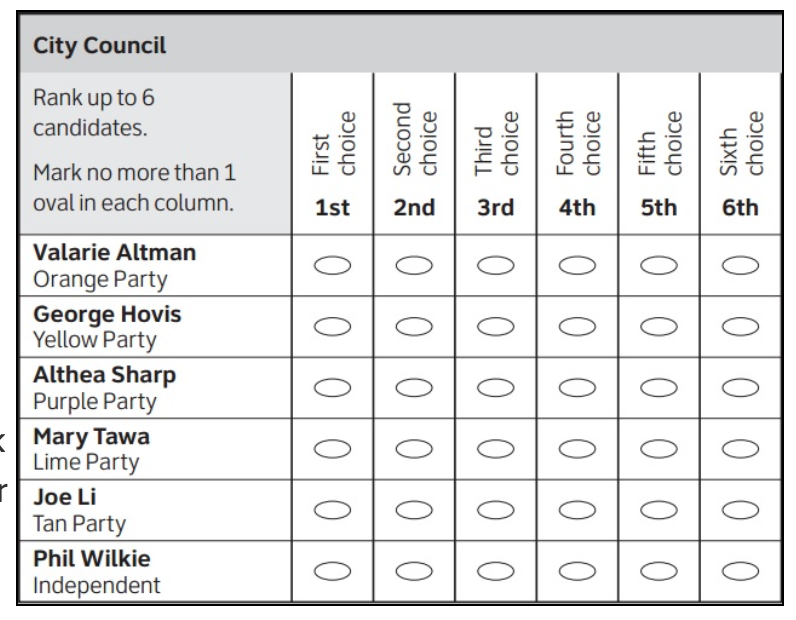
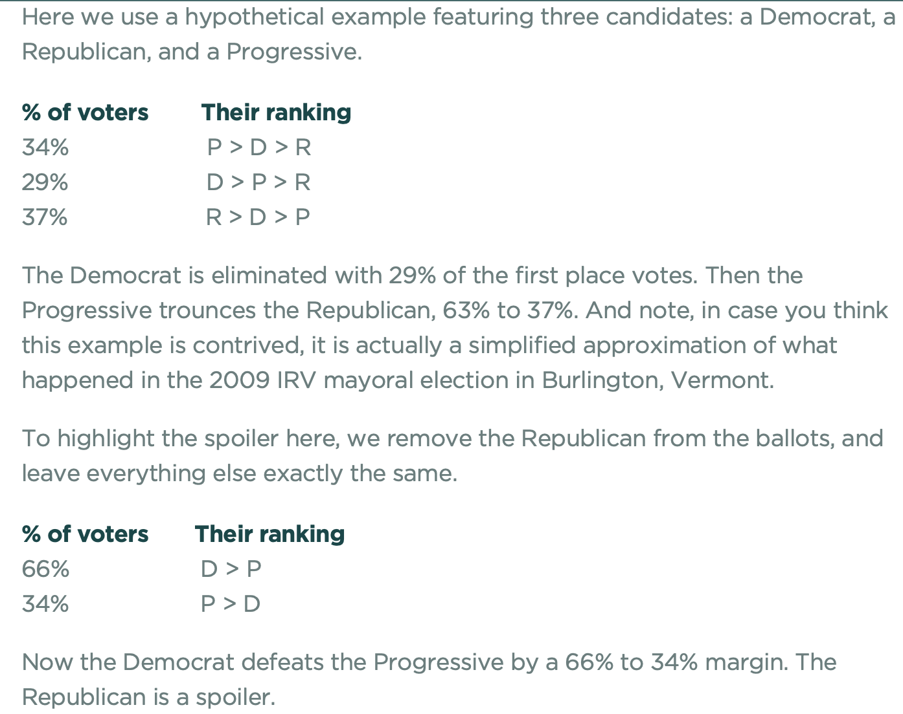
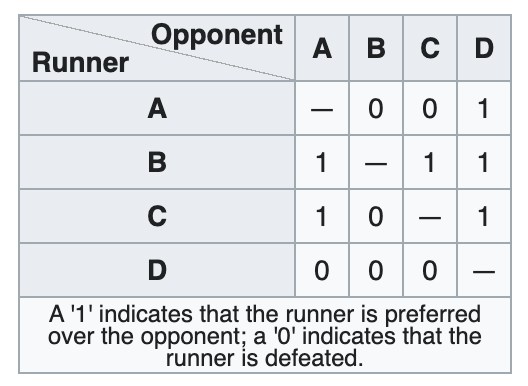
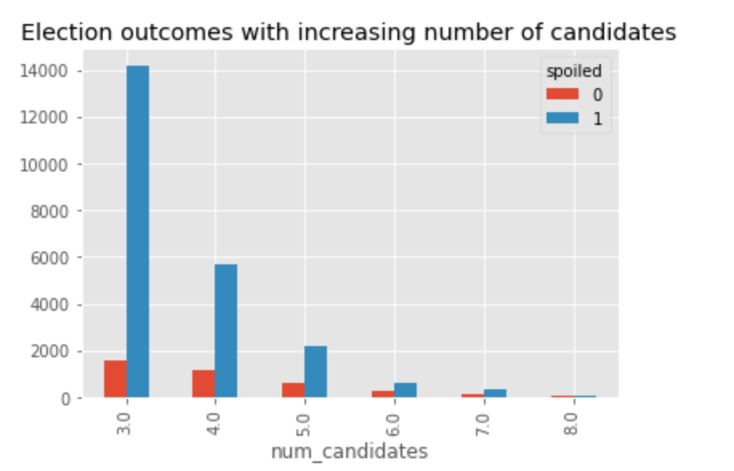

# Exploring the Likelihood of the Spoiler Effect in Ranked Choice Voting Systems

## Project Summary
This project aims to quantify how common the Spoiler Effect is in Ranked Choice Voting systems. While this project 
is still a work in progress, the end state is to have a web application that feeds user-generated ballots into a 
machine learning model. This model will output probability of the Spoiler Effect occurring, based on the ballots 
in the user-generated election. 

## Motivation
In [2019](https://www.politico.com/states/new-york/albany/story/2019/11/05/ranked-choice-voting-adopted-in-new-york-city-along-with-other-ballot-measures-1226390), New York City (NYC) voted to start using a ranked choice system of 
voting. One of this project's team members lived in NYC at the time and could vote in this election. In the days 
leading up to the vote, she was hearing from both sides of the issue, and one argument stood out: that in a Ranked 
Choice Voting (RCV) system, a candidate whom *no one* felt strongly about could win. 

This phenomenon incorporates 
various theorems (including, most famously, [Arrow's Impossibility Theorem](https://en.wikipedia.org/wiki/Arrow's_impossibility_theorem)), but generally goes by the name 'The Spoiler Effect.' She and this project's 
other teammates wanted to know if this 'spoiler effect' was something voters should worry about, or if it 
was so rare as to not affect the outcome of most elections.

Of course, this project is still a work in progress years after the 2019 election. This is because a secondary 
goal of this project is to simply increase our data science & software engineering skills. So, we have been taking our 
time with each step in order to maximize learnings along the way (and, of course, we are doing this in our 'free' time). 

## Credits
Big thanks goes to all the researchers & authors who helped us understand the intricacies of different voting systems 
throughout this project. Particular gratitude goes to:
- [Jon Tingvold](https://github.com/jontingvold), the author of the [`pyrankvote`](https://github.com/jontingvold/pyrankvote) package without which this project would have been 
extremely difficult
- [Paul Butler](https://paulbutler.org), a self-proclaimed quant out of NYC whose website 
https://ranked.vote helped us model our synthetic data for this project
- [Aaron Hamlin](https://www.linkedin.com/in/aaronhamlin/), the Executive Director of [The Center for Election Science](https://electionscience.org) who 
put us in touch with Paul & generally helped us navigate the complicated world of voting systems.
  
## What is Ranked Choice Voting?
Ranked Choice Voting is ["an electoral system in which voters rank candidates by preference on their ballots."](https://ballotpedia.org/Ranked-choice_voting_(RCV)) A typical ballot in an RCV election looks like this: 

As you can see, instead of voting for a single candidate, voters are asked to grade all possible candidates 
according to preference.

**Note:** sites like [Election Science](https://electionscience.org/library/the-spoiler-effect/) also call RCV voting 
"Instant Runoff Voting."

## What is the Spoiler Effect?
["In election parlance, a spoiler is a non-winning candidate whose presence on the ballot affects which candidate 
wins. In mathematical terms, the spoiler effect is when a voting method exhibits failure of a property known as 
independence of irrelevant alternatives."](https://electionscience.org/library/the-spoiler-effect/)

Check out [this video](https://www.youtube.com/watch?v=JtKAScORevQ) for a more in depth explanation. 

Below is a nice example to read through: 

Even though the Spoiler Effect can happen in almost any election system, [proponents of Ranked Choice Voting say](http://archive3.fairvote.org/reforms/instant-runoff-voting/irv-and-the-status-quo/spoiler-effect/) that it is 
so uncommon a phenomenon that voters shouldn't have to worry about it. However, a good number of people [say the 
opposite.](https://psephomancy.medium.com/ranked-choice-voting-doesnt-fix-the-spoiler-effect-80ed58bff72b) So, 
what's really going on? *That's the question this project aims to answer...*

tktk -- diff btwn exhausted ballot & spoiled effect

## Methods
### Data & Features
Finding data with which to train our model with was *difficult*. There are hardly any public datasets that include 
1+ spoiled elections (in an RCV system), let alone tens of thousands. For this reason, we chose one of the most famous 
spoiled, RCV elections off of which we could model synthetic data: [Burlington's 2009 mayoral election.](http://bolson.org/~bolson/2009/20090303_burlington_vt_mayor.html) In this election, a candidate named Kurt Wright acted as a Spoiler. 
Without his presence in the candidate pool, Andy Montroll would have won. Due to this election's mishaps, Burlington 
voted to repeal RCV voting [in 2010.](https://archive.vpr.org/vpr-news/burlington-voters-repeal-instant-runoff-voting/)

After inspecting the [normalized](https://github.com/ranked-vote/rcv-data-format/blob/master/README.md#normalized-vs-raw) data from this election, we concluded that it took the following features to make an "election":
- A certain amount of noise across the ballots
- A specific number of candidates
- A likely distribution of votes
- A specific number of ballots

**Noise**

To model the 'noise' that one would expect to see in real-world elections, we created elections with a certain 
amount of noise. We defined this noise as a random number between 1-15 that would represent the percentage of total 
ballots 
in a specific election that would be missing a vote for a certain candidate. For example, if there were 4 possible 
candidates for an election, a 'noisy' ballot would be one that had votes for 2/4 candidates, instead of 4/4.

**Number of Candidates**

After inspecting the number of candidates in various RCV elections in the past, we found that most elections had 
between 3-8 candidates, while the simplest type of election to model the Spoiler Effect would be an election with 3 
candidates. So, our script picks a number of candidates for each election between 3-8, with 3 candidates being the 
most likely choice & 8 being the least.

**Distribution of votes**

Since it's unlikely in reality that each candidate would get an equal share of votes in an election, we decided to 
randomly generate weights & assign them to each candidate per election ("ballot-weight" below). The higher a 
candidate's 
weight, the 
more 
votes that candidate received.

**A specific number of ballots**

Taking into account the number of candidates in each election + each candidate's ballot-weight, we generated a 
certain number of ballots per election. We constrained the number of ballots per election to be between 50 and 50,000. 

**What we chose *not* to model**

We chose *not* to model subjective features that come with any election, such as:
- Party affiliation of voters & candidates
- Location & date of election
- Voter & candidate gender, sex, & socio-economic demographics

We chose not to include these features in our modeled data in order to mitigate bias. Since the Burlington '09 
election was our only real source of an RCV election that was spoiled, we did not feel comfortable using it to model 
these more subjective features. We also did not want to allow for the possibility that our data could lead to spurious 
correlations, such as *"elections with all-male candidates result in the Spoiler Effect."*

### Strategy 
A simple way to identify a spoiled election is if the winning candidate is not also the [Condorcet winner.](https://en.wikipedia.org/wiki/Condorcet_method) The Condorcet winner is the candidate who wins the majority vote in 
all pairwise contests, as visualized below: 

You can see that a `1` indicates the winning candidate, and a `0` indicates the losing candidate. This matrix 
represents a single ballot. In order to calculate the Condorcet winner across an entire election, you simply add 
each ballot's Condorcet matrix together & take the candidate who won the highest number of head-to-head/pairwise 
contests. 

This is precisely how built our algorithm to determine whether an election was spoiled: calculate the 
Condorcet winner, allow `pyrankvote` to calculate the actual winner, and then compare the two. If the winners were  
the same, the election was not spoiled; if they differed, the election was spoiled. 

**Note:** our algorithm does not identify which one of the candidates acted as the Spoiler.

## Preliminary observations 
1. We have noticed that the more candidates are in an election, the more spoiled elections there are. This is in line 
with intuition: since there are more candidates, there are more head-to-head contests (i.e. a larger pairwise matrix)
, which results in an increased likelihood that the Condorcet winner is not also the actual (i.e. `pyrankvote`) winner.

## How to run & use this app
- Streamlit app hosted on Heroku?

### Output

## Resources (tmp)
### Burlington '09:
- https://integralpsychosis.wordpress.com/2009/03/16/burlingtons-2009-mayoral-election-did-irv-fail-the-voters/

### What is Ranked Choice Voting:
- https://www.fairvote.org/rcv#11

### Spoiler Effect:
- http://math.hws.edu/eck/math110_f08/voting.html
- Note: Spoiler Effect can happen in any election, but it is apparently extremely unlikely in ranked choice voting systems
- https://www.washingtonpost.com/news/the-fix/wp/2014/10/08/how-often-do-third-party-candidates-actually-spoil-elections-not-very/

### Arrow's Impossibility Theorem: 
- https://www.explainxkcd.com/wiki/index.php/1844:_Voting_Systems

### Arguments against Ranked Choice Voting:
- https://mainecampus.com/2020/03/ranked-choice-voting-is-unconstitutional-and-undemocratic/
- Will confuse voters
- https://www.themainewire.com/2020/02/ranked-choice-voting-in-alaska-rcv-fails-to-deliver-on-its-promises-to-voters/
- Even in RCV, 2 parties will still dominate: https://www.rangevoting.org/TarrIrv.html
- https://minguo.info/election_methods/irv

### Pro-RCV/explainer articles:
- https://ctnewsjunkie.com/2015/06/12/op-ed_no_more_spoilers_instant_runoff_voting_makes_third_parties_viable/
- https://www.fairvote.org/alternatives

### Overall explainer on voting methods:
- http://www.ams.org/publicoutreach/feature-column/fcarc-voting-decision
- http://zesty.ca/voting/sim/
